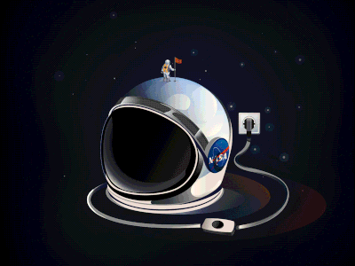

<h1>EX-6</h1>

<hr>
<p align="center">
    <a href="https://api.nasa.gov/" target="blank"></a>
</p>

<h2>Ola Ibrahim</h2>

<p><pre>Email:
        <a href="mailto:olaib@edu.hac.ac.il">olaib@edu.hac.ac.il</a>
</pre></p>

## Description

<P>
A website that includes both a server side and a client side using Express and ejs combined with a database(MYSQL).
<br><b>User registration</b> and login to the website, and the ability to search for images from the 
<a href="https://apod.nasa.gov/apod/astropix.html">NASA APOD</a>.</p>
<hr>
<h3>Polling is implemented.</h3>

## Errors handling:
<ul>
<li>Nasa Errors</li>
<li>Validation DB Errors</li>
<li>Server side Errors</li>
<li>Other Validations Errors</li>
<li>Connection Failed</li>
</ul>

## installation
for creating the database.sqlite again(refresh)
run this command:

```bash
$ node_modules/.bin/sequelize db:migrate
```
<br>

```bash
$ npm install
```

## Running the app

```bash
# Nodemon
$ nodemon app.js
````

```bash
# Node
$ node app.js
```

<span>Then open your browser at http://localhost:3000 to access the login page</p>


